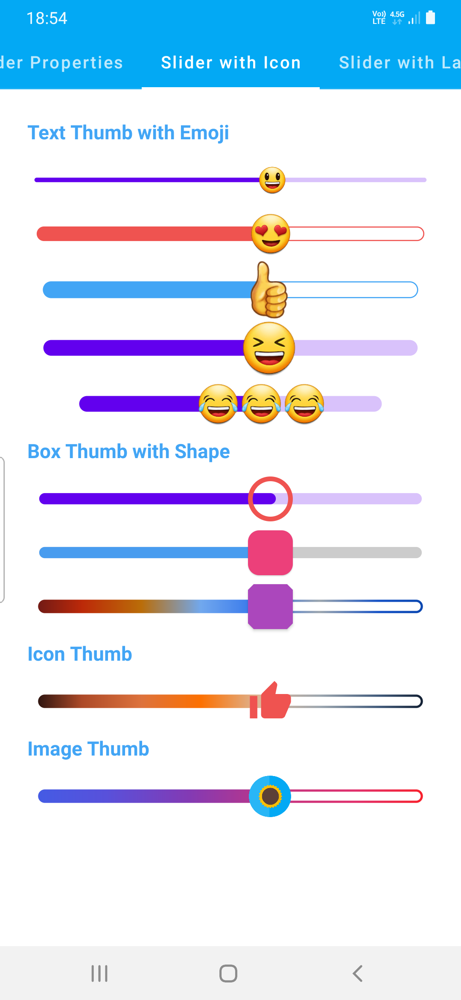
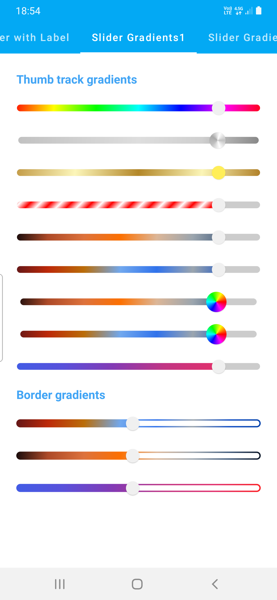
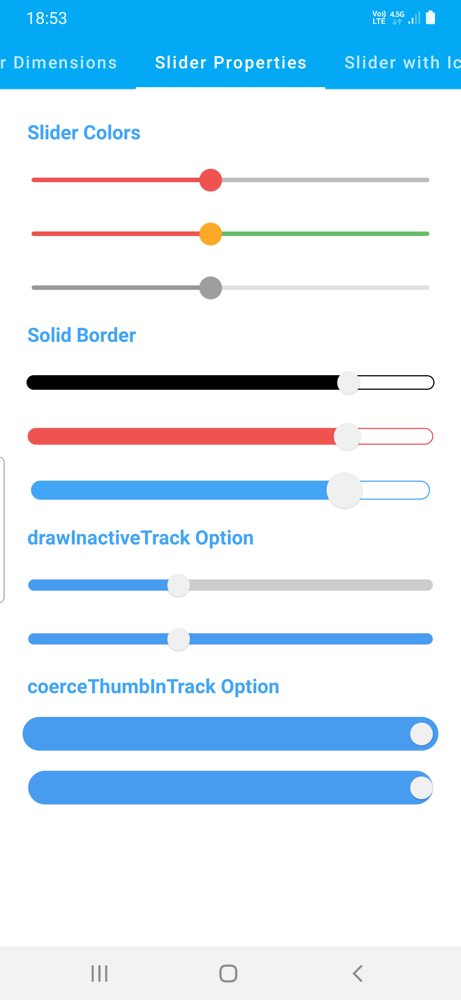
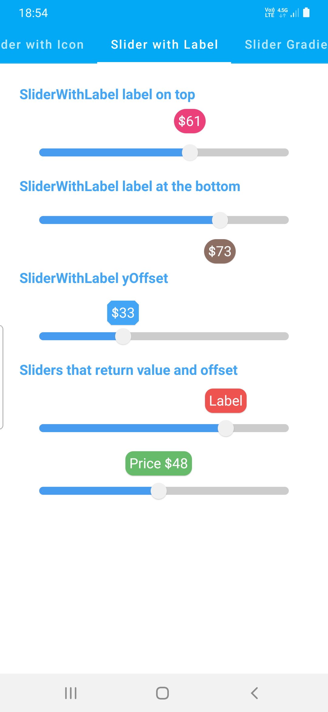

# Compose Colorful Customizable Sliders

[](https://jitpack.io/#SmartToolFactory/Compose-Colorful-Sliders)

Colorful sliders that can have Solid or Gradient colors for thumb or track which can have thumb and
track with varying sizes, borders with solid or gradient colors. And Sliders with emojis, or custom
Composables like **Icon**.

| Slider with Icon | Gradient  | Properties  | Slider with Label |  Dimensions |
| ----------|-----------| -----------| -----------| -----------|
|  |  |  |   |  |

## ColorfulSlider

Sliders that can use Color or gradient for track, thumb, or tick colors with custom thumb and track
heights.

```
@Composable
fun ColorfulSlider(
    value: Float,
    onValueChange: (Float) -> Unit,
    modifier: Modifier = Modifier,
    enabled: Boolean = true,
    valueRange: ClosedFloatingPointRange<Float> = 0f..1f,
    steps: Int = 0,
    onValueChangeFinished: (() -> Unit)? = null,
    trackHeight: Dp = TrackHeight,
    thumbRadius: Dp = ThumbRadius,
    colors: MaterialSliderColors = MaterialSliderDefaults.defaultColors(),
    borderStroke: BorderStroke? = null,
    drawInactiveTrack: Boolean = true,
    coerceThumbInTrack: Boolean = false
) 
```

And one that returns thumb position as `Offset`

```
fun ColorfulSlider(
    value: Float,
    onValueChange: (Float, Offset) -> Unit,
    modifier: Modifier = Modifier,
    enabled: Boolean = true,
    valueRange: ClosedFloatingPointRange<Float> = 0f..1f,
    steps: Int = 0,
    onValueChangeFinished: (() -> Unit)? = null,
    trackHeight: Dp = TrackHeight,
    thumbRadius: Dp = ThumbRadius,
    colors: MaterialSliderColors = MaterialSliderDefaults.defaultColors(),
    borderStroke: BorderStroke? = null,
    drawInactiveTrack: Boolean = true,
    coerceThumbInTrack: Boolean = false
)
```

* **value** current value of the Slider. If outside of **valueRange** provided, value will be
  **coerced** to this range.
* **onValueChange** lambda that returns value, position of **thumb** as **Offset**, vertical center
  is stored in y.
* **modifier** modifiers for the Slider layout
* **enabled** whether or not component is enabled and can be interacted with or not
* **valueRange** range of values that Slider value can take. Passed value will be coerced to this
  range
* **steps** if greater than 0, specifies the amounts of discrete values, evenly distributed between
  across the whole value range. If 0, slider will behave as a continuous slider and allow to choose
  any value from the range specified. Must not be negative.
* **trackHeight** height of the track that will be drawn on Canvas. half of trackHeight is used
  as **stroke** width.
* **thumbRadius** radius of thumb of the the slider
* **colors** MaterialSliderColors** that will be used to determine the color of the Slider parts in
  different state. See **MaterialSliderDefaults.defaultColors**,  **
  MaterialSliderDefaults.customColors** or other functions to customize.
* **borderStroke** draws border around the track with given width in dp.
* **drawInactiveTrack** flag to draw **InActive** track between active progress and track end.
* **coerceThumbInTrack** when set to true track's start position is matched to thumbs left on start
  and thumbs right at the end of the track. Use this when **trackHeight** is bigger than **
  thumbRadius**.

Usage

```
ColorfulSlider(
    value = progress2,
    thumbRadius = 10.dp,
    trackHeight = 10.dp,
    onValueChange = { it ->
        progress2 = it
    },
    colors = MaterialSliderDefaults.materialColors(
        inactiveTrackColor = SliderBrushColor(color = Color.Transparent),
        activeTrackColor = SliderBrushColor(
            brush = sunriseGradient(),
        )
    ),
    borderStroke = BorderStroke(2.dp, sunriseGradient())
)
```

`SliderBrushColor` is a data class which can be used to set color or brush for any color property

```

/**
 * Data class that contains color or/and brush property for drawing track section of
 * [ColorfulSlider]
 */
data class SliderBrushColor(
    val color: Color = Color.Unspecified,
    val brush: Brush? = null
) {
    /**
     * [Brush] that is not **null** [brush] property or [SolidColor] that is not nullable and
     * contains [color] property as [SolidColor.value]
     */
    val activeBrush: Brush
        get() = brush ?: solidColor

    /**
     * [SolidColor] is a [Brush] that
     * wraps [color] property that is used for [activeBrush] if [brush] property is **null**
     */
    val solidColor = SolidColor(color)
}
```

## SliderWithLabel

Sliders that can move a label above the Slider and display progress

```
fun SliderWithLabel(
    value: Float,
    onValueChange: (Float) -> Unit,
    modifier: Modifier = Modifier,
    enabled: Boolean = true,
    valueRange: ClosedFloatingPointRange<Float> = 0f..1f,
    steps: Int = 0,
    onValueChangeFinished: (() -> Unit)? = null,
    trackHeight: Dp = TrackHeight,
    thumbRadius: Dp = ThumbRadius,
    colors: MaterialSliderColors = MaterialSliderDefaults.defaultColors(),
    borderStroke: BorderStroke? = null,
    drawInactiveTrack: Boolean = true,
    coerceThumbInTrack: Boolean = false,
    labelPosition: LabelPosition = LabelPosition.Top,
    yOffset: Dp = 0.dp,
    label: @Composable () -> Unit = {}
)
```

Usage

```
SliderWithLabel(
    value = labelProgress,
    onValueChange = {
        labelProgress = it
    },
    thumbRadius = 10.dp,
    trackHeight = 10.dp,
    valueRange = 0f..100f,
    colors = MaterialSliderDefaults.materialColors(),
    labelPosition = LabelPosition.Bottom,
    label = {
        Text(
            text = "$${labelProgress.roundToInt()}",
            modifier = Modifier
                .shadow(1.dp, shape = CircleShape)
                .background(Brown400, shape = CircleShape)
                .padding(5.dp),
            color = Color.White
        )
    }
)
```

## ColorfulIconSlider

Sliders that can use any Composable for thumb and use Color or gradient for track, thumb, or tick
colors with custom thumb and track heights.

```
fun ColorfulIconSlider(
    modifier: Modifier = Modifier,
    value: Float,
    onValueChange: (Float, Offset) -> Unit,
    enabled: Boolean = true,
    valueRange: ClosedFloatingPointRange<Float> = 0f..1f,
    steps: Int = 0,
    onValueChangeFinished: (() -> Unit)? = null,
    trackHeight: Dp = TrackHeight,
    colors: MaterialSliderColors = MaterialSliderDefaults.defaultColors(),
    borderStroke: BorderStroke? = null,
    drawInactiveTrack: Boolean = true,
    coerceThumbInTrack: Boolean = false,
    thumb: @Composable () -> Unit
)
```

Usage

Emojis are transparent by default in Compose, you might want to set non-transparent color for `Text`
```
ColorfulIconSlider(
    value = progress,
    onValueChange = { value, offset ->
        progress = value
    },
    trackHeight = 14.dp,
    colors = MaterialSliderDefaults.materialColors(
        activeTrackColor = SliderBrushColor(color = Blue400),
        inactiveTrackColor = SliderBrushColor(color = Color.Transparent)
    ),
    borderStroke = BorderStroke(1.dp, Blue400)
) {
    Text(text = "👍", fontSize = 40.sp, color = Color.Black)
}
```

or

```
ColorfulIconSlider(
    value = progress,
    onValueChange = { value, offset ->
        progress = value
    },
    trackHeight = 10.dp,
    colors = MaterialSliderDefaults.materialColors(
        inactiveTrackColor = SliderBrushColor(color = Color.Transparent),
        activeTrackColor = SliderBrushColor(
            brush = instaGradient(),
        )
    ),
    borderStroke = BorderStroke(2.dp, instaGradient())
) {
    Image(
        painter = painterResource(id = R.drawable.stf),
        contentDescription = null,
        modifier = Modifier.size(40.dp)
    )
}
}
```


## Gradle Setup

To get a Git project into your build:

* Step 1. Add the JitPack repository to your build file Add it in your root build.gradle at the end
  of repositories:
```
allprojects {
  repositories {
      ...
      maven { url 'https://jitpack.io' }
  }
}
```

* Step 2. Add the dependency

```
dependencies {
  implementation 'com.github.SmartToolFactory:Compose-Colorful-Sliders:<version>'
}
```
